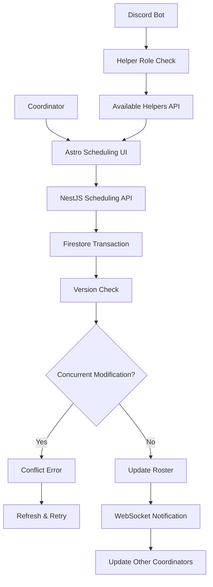

# Astro.build Integration Plan for Ulti-Project Discord Bot

## Overview

This plan outlines the integration of an Astro.build website with the existing Discord bot project to provide a web interface for viewing signups and community information, moving away from Google Sheets dependency.

**Note**: This project has been migrated to a pnpm workspace structure with the website in `apps/website/`, Discord bot in `apps/discord-bot/`, and shared types in `packages/shared/`.

## Current Implementation Status (Updated)

### ✅ Phase 1: Complete - Project Setup & Mock Implementation

- Astro project created with React integration
- pnpm workspace configured with shared types
- Mock data system with 100 realistic signups

### ✅ Phase 2: Complete - UI/UX Development  

- Landing page with theme toggle (dark/light modes)
- Signups page with comprehensive filtering
- **Client-side pagination** implemented with React (no page refreshes)
- Responsive design with mobile support
- CSS custom properties for theming

### 🚧 Phase 3: Pending - Backend API Integration

- Mock API currently in use
- Ready for NestJS backend integration when needed

### Key Implementation Learnings

1. **React Components Require Client Directives**: Unlike standard Astro components, React components need explicit `client:*` directives for interactivity
2. **Avoid Inline Scripts for Complex Interactivity**: External React components with proper TypeScript support are more maintainable
3. **Use `:global()` for Component Styling**: When styling React components from Astro pages, use `:global()` selectors
4. **Client-Side Pagination Benefits**: Eliminates page flicker and provides better UX than server-side pagination with URL params
5. **TypeScript Integration**: Some type mismatches between shared types and runtime data don't affect functionality but should be addressed

## Current State Analysis

### Existing Tech Stack

- **Backend**: NestJS with TypeScript
- **Database**: Firebase Firestore
- **External Services**: Google Sheets (to be phased out), Discord.js
- **Data Models**: Well-defined signup system with encounters, party types, and user management

### Key Data Structures

- **SignupDocument**: Contains character info, encounter, party status, availability, prog points
- **Encounters**: TOP, UWU, UCOB, TEA, DSR, FRU (Final Fantasy XIV Ultimate raids)
- **Party Types**: Early Prog Party, Prog Party, Clear Party, Cleared
- **Signup Status**: PENDING, APPROVED, DECLINED, UPDATE_PENDING

## Proposed Architecture

### 1. Astro Website Structure (pnpm Workspace)

```
ulti-project/ (workspace root)
├── pnpm-workspace.yaml
├── package.json (workspace root)
├── apps/
│   ├── website/
│   │   ├── src/
│   │   │   ├── components/
│   │   │   │   ├── SignupTable.astro
│   │   │   │   ├── EncounterFilter.astro
│   │   │   │   ├── PartyTypeFilter.astro
│   │   │   │   ├── Layout.astro
│   │   │   │   └── Navigation.astro
│   │   │   ├── pages/
│   │   │   │   ├── index.astro (Landing page)
│   │   │   │   ├── signups.astro (Main signups page)
│   │   │   │   └── api/
│   │   │   │       └── signups.json.ts (API endpoint)
│   │   │   ├── layouts/
│   │   │   │   └── BaseLayout.astro
│   │   │   └── styles/
│   │   │       └── global.css
│   │   ├── public/
│   │   ├── astro.config.mjs
│   │   └── package.json
│   └── discord-bot/
│       ├── src/ (existing NestJS app)
│       └── package.json
└── packages/
    └── shared/
        ├── src/ (shared types and utilities)
        └── package.json
```

### 2. Integration Points

#### A. NestJS Backend API Integration

- **Extend Existing Backend**: Add new API endpoints to the existing NestJS application
- **Shared Firebase Access**: Leverage existing Firebase Admin SDK and collections
- **Caching Layer**: Implement Redis or in-memory caching in NestJS for frequently accessed data
- **Rate Limiting**: Protect API endpoints from excessive requests

#### B. Astro Frontend Integration

- **API Client**: Create HTTP client to communicate with NestJS backend
- **Static Generation**: Pre-build pages with signup data for better performance
- **Client-side Hydration**: Add interactivity for filtering and real-time updates
- **CDN Optimization**: Serve static assets and cached data from CDN

## Implementation Plan

### Phase 1: Project Setup & Mock Implementation (Week 1)

#### 1.1 Astro Installation & Configuration (pnpm Workspace)

```bash
# In workspace root
cd apps/website
pnpm install @astrojs/tailwind @astrojs/react
# Note: No firebase-admin yet - we'll add this in Phase 3

# Or from workspace root:
pnpm --filter website add @astrojs/tailwind @astrojs/react
```

#### 1.2 Project Structure with Mock Data (pnpm Workspace)

```
apps/website/
├── src/
│   ├── components/
│   │   ├── SignupTable.astro
│   │   ├── FilterPanel.astro
│   │   └── Layout.astro
│   ├── pages/
│   │   ├── index.astro
│   │   ├── signups.astro
│   │   └── api/
│   │       └── signups.json.ts (mock API endpoint)
│   ├── lib/
│   │   ├── api.ts (mock API calls)
│   │   ├── mockData.ts (sample signup data)
│   │   └── types.ts
│   └── styles/
│       └── global.css
├── astro.config.mjs
└── package.json

packages/shared/
├── src/
│   ├── types/
│   │   ├── signup.ts (shared type definitions)
│   │   ├── encounter.ts
│   │   └── index.ts
│   └── utils/
│       └── index.ts
└── package.json
```

#### 1.3 Mock Data Implementation (with Shared Types)

Create realistic mock data that matches your existing Firebase schema, using shared types from the workspace:

```typescript
// apps/website/src/lib/mockData.ts
import type { SignupDocument, Encounter } from '@ulti-project/shared';

export const mockSignups: SignupDocument[] = [
  {
    id: '1',
    characterName: 'Warrior Light',
    world: 'Gilgamesh',
    encounter: 'FRU',
    partyType: 'Prog',
    role: 'Tank',
    job: 'Paladin',
    progPoint: 'P2 Light Rampant', // Matches current prog requirements
    availability: ['Tuesday 8PM EST', 'Thursday 8PM EST'],
    discordId: '123456789',
    status: 'approved',
    lastUpdated: new Date('2024-01-15'),
    schedulingStatus: 'unscheduled',
    squad: 'Sex Gods 3000'
  },
  {
    id: '2',
    characterName: 'Astral Healer',
    world: 'Leviathan',
    encounter: 'FRU',
    partyType: 'Clear',
    role: 'Healer',
    job: 'White Mage',
    progPoint: 'P5 Fulgent Blade 1 (Exalines 1)', // Clear-ready prog point
    availability: ['Monday 7PM EST', 'Wednesday 7PM EST', 'Friday 7PM EST'],
    discordId: '987654321',
    status: 'approved',
    lastUpdated: new Date('2024-01-14'),
    schedulingStatus: 'scheduled',
    squad: 'Space Travelers'
  },
  {
    id: '3',
    characterName: 'Aether Striker',
    world: 'Sargatanas',
    encounter: 'FRU',
    partyType: 'Prog',
    role: 'DPS',
    job: 'Dragoon',
    progPoint: 'P2 Light Rampant',
    availability: ['Thursday 9PM EST', 'Saturday 8PM EST'],
    discordId: '456789123',
    status: 'approved',
    lastUpdated: new Date('2024-01-13'),
    schedulingStatus: 'unscheduled',
    squad: null
  },
  // Add more FRU-focused entries to match current content focus
];

export const mockEncounters: Encounter[] = [
  { id: 'FRU', name: 'Futures Rewritten (Ultimate)', shortName: 'FRU' },
  { id: 'TOP', name: 'The Omega Protocol (Ultimate)', shortName: 'TOP' },
  { id: 'DSR', name: 'Dragonsong\'s Reprise (Ultimate)', shortName: 'DSR' },
  { id: 'TEA', name: 'The Epic of Alexander (Ultimate)', shortName: 'TEA' },
  { id: 'UWU', name: 'The Weapon\'s Refrain (Ultimate)', shortName: 'UWU' },
  { id: 'UCOB', name: 'The Unending Coil of Bahamut (Ultimate)', shortName: 'UCOB' }
];
```

#### 1.4 Mock API Implementation

```typescript
// apps/website/src/lib/api.ts
import type { SignupDocument, Encounter, SignupFilters } from '@ulti-project/shared';
import { mockSignups, mockEncounters } from './mockData';

// SignupFilters interface is now imported from @ulti-project/shared

export async function getSignups(filters: SignupFilters = {}) {
  // Simulate API delay for realistic experience
  await new Promise(resolve => setTimeout(resolve, 300));
  
  // Single-pass filtering for efficiency
  const filteredSignups = mockSignups.filter(signup => {
    // Early returns for better performance
    if (filters.encounter && signup.encounter !== filters.encounter) {
      return false;
    }
    
    if (filters.partyType && signup.partyType !== filters.partyType) {
      return false;
    }
    
    if (filters.role && signup.role !== filters.role) {
      return false;
    }
    
    if (filters.search) {
      const searchLower = filters.search.toLowerCase();
      const characterMatch = signup.characterName.toLowerCase().includes(searchLower);
      const worldMatch = signup.world.toLowerCase().includes(searchLower);
      
      if (!characterMatch && !worldMatch) {
        return false;
      }
    }
    
    return true;
  });
  
  return {
    signups: filteredSignups,
    total: filteredSignups.length,
    encounters: mockEncounters
  };
}

export async function getCommunityStats() {
  await new Promise(resolve => setTimeout(resolve, 200));
  
  return {
    totalSignups: mockSignups.length,
    activeEncounters: mockEncounters.length,
    currentContent: 'Future\'s Rewritten (FRU)', // Matches current Carrd focus
    squads: [
      { name: 'Sex Gods 3000', status: 'active' },
      { name: 'Space Travelers', status: 'active' }
    ],
    progRequirements: {
      'FRU': {
        prog: 'P2 Light Rampant',
        clear: 'P5 Fulgent Blade 1 (Exalines 1)'
      }
    },
    socialLinks: {
      discord: 'https://discord.gg/sausfest',
      twitter: '#',
      twitch: '#',
      youtube: '#'
    }
  };
}
```

#### 1.5 Workspace Structure

- Website is already in `apps/website/` as part of pnpm workspace
- Shared types and utilities in `packages/shared/`
- Discord bot in `apps/discord-bot/`
- Workspace-level scripts in root `package.json` for coordinated development
- Focus on UI/UX development with shared type safety

### Phase 2: UI/UX Development with Mock Data (Week 2)

#### 2.1 Landing Page (`/`)

**Content Structure** (Based on [current Carrd site](https://ultiproject.carrd.co/)):

**Hero Section:**

- **Main Tagline**: "A FFXIV opportunity for NA players to progress thru **ENDGAME CONTENT** and achieve their 1st-time clears!"
- **Current Content Focus**: "Future's Rewritten (FRU)" (dynamically updated)
- **Primary CTA**: "SIGN UP HERE" → Links to `/signups` page
- **Social Links**: Twitter, Twitch, YouTube, Discord

**Welcome Section:**

- **Community Identity**: "**Sausfest** is a FFXIV community located on the Aether Data Center that helps players progress and clear **Endgame Content!**"
- **Current Content**: Dynamically show active encounters
- **Community Stats**: Total signups, active encounters, recent clears

**Clear Squads Section:**

- **Description**: "Teams that aim to provide a safe & efficient prog/clear experience for players in the hosted **Endgame Content**"
- **Squad Showcase**: "Meet the Squads!" with dynamic list (Sex Gods 3000, Space Travelers, etc.)

**Qualified Prog-points Section:**

- **Dynamic Requirements**: Show current prog-point requirements for each encounter
- **Example**:
  - **Prog Parties**: P2 Light Rampant
  - **Clear-Ready**: P5 Fulgent Blade 1 (Exalines 1)

**Sign-Up Instructions:**

- **Process Overview**: 4-step signup process
- **Discord Integration**: Links to Discord server
- **Requirements**: Character verification, role assignment
- **Important Notes**: "Please turn Discord DMs & pings ON"

**Quick Stats Dashboard:**

- Total active signups
- Active encounters count
- Current squad information
- Community milestones

#### 2.2 Signups Page (`/signups`)

**Features:**

- Comprehensive signup table with all approved signups
- Multi-level filtering system
- Responsive design for mobile/desktop
- Real-time updates (optional)
- **Future**: Integration with scheduling system

**Table Columns:**

- Character Name & World
- Encounter (with friendly names and icons)
- Party Type (Prog/Clear with color coding)
- Role/Job
- Prog Point
- Availability
- Last Updated
- **Future**: Scheduling Status (Unscheduled/Scheduled/Confirmed)

**Filtering Options:**

- **Encounter Filter**: Dropdown with all encounters (TOP, UWU, UCOB, TEA, DSR, FRU)
- **Party Type Filter**: Checkboxes for Early Prog, Prog, Clear parties
- **Role Filter**: Filter by tank, healer, DPS, or specific jobs
- **Search**: Text search across character names and worlds
- **Future**: Filter by scheduling status

#### 2.3 Component Architecture

**Updated Architecture (As Implemented):**

Instead of separate Astro components for each filter, we implemented a unified React component for better state management:

**SignupsTable.tsx (React Component)**

```typescript
import type { SignupDisplayData, EncounterInfo } from '@ulti-project/shared/types';

interface SignupsTableProps {
  signups: SignupDisplayData[];
  encounters: EncounterInfo[];
}

export function SignupsTable({ signups, encounters }: SignupsTableProps) {
  // Unified state management for filters and pagination
  const [currentPage, setCurrentPage] = useState(1);
  const [pageSize, setPageSize] = useState(20);
  const [filters, setFilters] = useState({
    encounter: '',
    partyType: '',
    role: '',
    search: ''
  });
  
  // All filtering, pagination, and rendering logic in one component
  // Benefits: Simpler state management, no prop drilling, better performance
}
```

**Integration in Astro Page:**

```astro
---
import { SignupsTable } from '../components/SignupsTable';
import { getSignups } from '../lib/api';

const signupsData = await getSignups({}, { page: 1, pageSize: 1000 });
---

<SignupsTable 
  signups={signupsData.signups} 
  encounters={signupsData.encounters}
  client:load 
/>
```

This unified approach proved more maintainable than separate filter components.

### Phase 3: Backend API Integration (Week 3-4)

**Goal**: Replace mock API calls with real NestJS backend integration

#### 3.0 Prerequisites

- Fully functional website with mock data from Phase 2
- All UI components tested and working
- Filtering, sorting, and search functionality complete

#### 3.1 NestJS API Endpoints

Add new controllers to existing NestJS application:

```typescript
// apps/discord-bot/src/website/website.controller.ts
@Controller('api/website')
export class WebsiteController {
  constructor(private readonly signupCollection: SignupCollection) {}

  @Get('signups')
  @UseGuards(RateLimitGuard)
  @Cache(300) // 5-minute cache
  async getSignups(@Query() filters: SignupFiltersDto) {
    return this.signupCollection.getApprovedSignups(filters);
  }

  @Get('stats')
  @Cache(3600) // 1-hour cache
  async getStats() {
    return this.signupCollection.getCommunityStats();
  }
}
```

#### 3.2 Caching Strategy

Implement caching in NestJS to minimize Firestore reads:

```typescript
// apps/discord-bot/src/website/website.service.ts
@Injectable()
export class WebsiteService {
  private readonly cache = new Map();
  private readonly CACHE_TTL = 5 * 60 * 1000; // 5 minutes

  async getCachedSignups(filters: SignupFilters) {
    const cacheKey = JSON.stringify(filters);
    const cached = this.cache.get(cacheKey);
    
    if (cached && Date.now() - cached.timestamp < this.CACHE_TTL) {
      return cached.data;
    }

    const data = await this.fetchSignupsFromFirestore(filters);
    this.cache.set(cacheKey, { data, timestamp: Date.now() });
    return data;
  }
}
```

#### 3.3 Replace Mock API with Real API

Update the existing mock API to call real NestJS endpoints:

```typescript
// apps/website/src/lib/api.ts - Updated from mock implementation
const USE_MOCK_DATA = process.env.NODE_ENV === 'development' && process.env.USE_MOCK === 'true';

export async function getSignups(filters: SignupFilters = {}) {
  if (USE_MOCK_DATA) {
    // Keep mock implementation for development
    return getMockSignups(filters);
  }

  // Real API implementation
  const baseUrl = process.env.API_BASE_URL || 'http://localhost:3000';
  const params = new URLSearchParams(filters as any);
  const response = await fetch(`${baseUrl}/api/website/signups?${params}`);
  
  if (!response.ok) {
    throw new Error(`API Error: ${response.status}`);
  }
  
  return response.json();
}

export async function getCommunityStats() {
  if (USE_MOCK_DATA) {
    return getMockCommunityStats();
  }

  const baseUrl = process.env.API_BASE_URL || 'http://localhost:3000';
  const response = await fetch(`${baseUrl}/api/website/stats`);
  
  if (!response.ok) {
    throw new Error(`API Error: ${response.status}`);
  }
  
  return response.json();
}
```

#### 3.4 Environment Configuration

```bash
# apps/website/.env.local
API_BASE_URL=http://localhost:3000
USE_MOCK=false  # Set to true to use mock data during development
```

### Phase 4: Polish & Optimization (Week 4-5)

#### 4.1 Design System

- **Color Scheme**: Dark theme matching Discord aesthetic
- **Typography**: Clean, readable fonts
- **Components**: Consistent button styles, form elements
- **Icons**: Encounter-specific icons, status indicators

#### 4.2 Responsive Design

- Mobile-first approach
- Collapsible filters on mobile
- Horizontal scrolling for table on small screens
- Touch-friendly interface elements

#### 4.3 Interactive Features

- **Client-side Filtering**: Fast filtering without page reloads
- **Sorting**: Click column headers to sort
- **Pagination**: Handle large datasets efficiently
- **Export**: Option to export filtered results

#### 4.4 React Integration Best Practices (Learned from Implementation)

**Client Directives for React Components:**

When integrating React components in Astro, you must use client directives to enable interactivity:

```typescript
// apps/website/src/pages/signups.astro
---
import { SignupsTable } from '../components/SignupsTable';
const signupsData = await getSignups({}, { page: 1, pageSize: 1000 });
---

<!-- React component with client:load directive for immediate hydration -->
<SignupsTable 
  signups={signupsData.signups} 
  encounters={signupsData.encounters}
  client:load 
/>
```

**Key Client Directives:**

- `client:load` - Hydrates immediately on page load (best for above-the-fold interactive components)
- `client:idle` - Hydrates when browser is idle (good for less critical components)
- `client:visible` - Hydrates when component enters viewport (ideal for below-the-fold components)
- `client:media` - Hydrates based on media query (useful for responsive components)
- `client:only` - Skips SSR entirely, only renders on client

**Styling React Components from Astro:**

Use `:global()` selectors when styling React components from Astro pages:

```css
/* In your .astro file's <style> tag */
:global(.pagination-container) {
  display: flex;
  justify-content: center;
  margin-bottom: 2rem;
}

:global(.pagination-button) {
  background-color: var(--bg-secondary);
  border: 1px solid var(--border-primary);
  /* ... */
}
```

**Client-Side Pagination Implementation:**

Our implementation moved from server-side pagination (causing full page refreshes) to client-side pagination for better UX:

```typescript
// apps/website/src/components/SignupsTable.tsx
export function SignupsTable({ signups, encounters }: SignupsTableProps) {
  // State management for pagination
  const [currentPage, setCurrentPage] = useState(1);
  const [pageSize, setPageSize] = useState(20);
  
  // Client-side filtering and pagination logic
  const filteredSignups = useMemo(() => {
    return signups.filter(/* filtering logic */);
  }, [signups, filters]);
  
  const paginatedSignups = filteredSignups.slice(
    (currentPage - 1) * pageSize,
    currentPage * pageSize
  );
  
  // Benefits: No page refresh, preserved filter state, instant feedback
}
```

**Benefits of Client-Side Approach:**

- **No Page Flicker**: Smooth transitions between pages
- **State Preservation**: Filters and search remain intact
- **Instant Feedback**: No server round trips
- **Better UX**: Modern SPA-like experience within Astro's MPA architecture

### Phase 5: Deployment & Advanced Features (Week 5-6)

#### 5.1 Real-time Updates (Optional)

- WebSocket connection for live signup updates
- Toast notifications for new signups
- Auto-refresh mechanism

#### 5.2 Analytics & Insights

- Signup trends over time
- Popular encounters and prog points
- Community activity metrics

#### 5.3 SEO & Performance

- Meta tags for social sharing
- Image optimization
- Static generation where possible
- CDN integration

## Cost Considerations & Optimization

### Why Backend API Approach is More Cost-Effective

**Direct Firestore Access Costs (Avoided):**

- Document reads: $0.06 per 100,000 documents
- Index entry reads: Additional charges for complex queries  
- Network egress: $0.12/GB for external traffic
- **Potential monthly cost**: $50-200+ for moderate traffic

**Backend API Approach Benefits:**

- **Single Source of Truth**: NestJS backend handles all Firestore operations
- **Aggressive Caching**: 5-minute cache reduces Firestore reads by 95%+
- **Batch Operations**: Efficient data fetching and transformation
- **Rate Limiting**: Prevents excessive API calls and costs

### Caching Strategy Details

```typescript
// Multi-level caching approach
1. In-Memory Cache (NestJS): 5-minute TTL for frequently accessed data
2. Redis Cache (Optional): 1-hour TTL for expensive queries  
3. CDN Cache (Astro): Static pages cached at edge locations
4. Browser Cache: Client-side caching for user sessions

// Extreme optimization: Event-driven cache invalidation
5. Discord Bot Event Triggers: Only refresh cache when signups change
6. Full Dataset Caching: Keep entire signup dataset in memory indefinitely
7. Selective Updates: Only fetch changed documents on bot events
```

### Event-Driven Cache Strategy

```typescript
// In your NestJS backend
@Injectable()
export class SignupCacheService {
  private signupCache = new Map<string, SignupDocument>();
  private lastUpdated = new Date();

  // Load all signups once on startup
  async initializeCache() {
    const allSignups = await this.firestore.collection('signups').get();
    allSignups.docs.forEach(doc => {
      this.signupCache.set(doc.id, doc.data());
    });
  }

  // Only called when Discord bot creates/updates/deletes signups
  async invalidateSignup(signupId: string) {
    // Fetch only this one document from Firestore
    const doc = await this.firestore.collection('signups').doc(signupId).get();
    if (doc.exists) {
      this.signupCache.set(signupId, doc.data());
    } else {
      this.signupCache.delete(signupId);
    }
  }

  // Website requests always served from memory
  getSignups(filters?: SignupFilters): SignupDocument[] {
    return Array.from(this.signupCache.values()).filter(/* apply filters */);
  }
}
```

### Traffic Definitions & Cost Analysis

**"Moderate Traffic" Breakdown:**

- **Small Community**: 100-500 daily visitors, 2-10K page views/month
- **Medium Community**: 500-2000 daily visitors, 10-50K page views/month  
- **Large Community**: 2000+ daily visitors, 50K+ page views/month

**Direct Firestore Access Costs (What We're Avoiding):**

- Small: 10-50K Firestore reads/month = $6-30/month
- Medium: 50-200K Firestore reads/month = $30-120/month
- Large: 200K+ Firestore reads/month = $120+/month

### Realistic Cost Analysis (Based on Your Current Infrastructure)

**Current Setup:**

- Fly.io hosting: <$5/month
- Firestore: Free tier (within limits)
- **Total current cost**: <$5/month

### Estimated Additional Costs with Astro Website

**Option 1: Same Fly.io Instance (Recommended)**

- Serve Astro static files from NestJS backend
- Additional memory/CPU: $0-2/month (minimal static file serving)
- Firestore reads: $0/month (stays within free tier with caching)
- **Total additional cost**: $0-2/month
- **New total**: <$7/month

**Option 2: Separate Fly.io Instance for Astro**

- Dedicated Fly.io instance for Astro: $1-3/month
- Better isolation and scaling
- Firestore reads: $0/month (stays within free tier)
- **Total additional cost**: $1-3/month
- **New total**: $6-8/month

**Option 3: External Static Hosting (Not Recommended)**

- Astro on Vercel/Netlify: $0/month (free tier)
- Adds external dependency and potential CORS complexity
- **Total additional cost**: $0/month
- **New total**: <$5/month (unchanged but less ideal)

### Why Costs Stay So Low

**Firestore Free Tier Limits (Daily):**

- Document reads: 50,000/day
- Document writes: 20,000/day  
- Document deletes: 20,000/day
- Storage: 1 GiB total

**With Event-Driven Caching:**

- Initial cache load: ~100-1000 reads (one-time)
- Daily signup changes: ~10-50 reads/day
- Website traffic: 0 additional Firestore reads (served from cache)
- **Result**: Easily stays within 50K daily read limit

**Realistic Usage for FFXIV Community:**

- Total signups: ~500-2000 documents
- Daily new signups: ~5-20
- Daily website visitors: ~50-500
- **Firestore usage**: Well within free tier limits

### Performance Optimizations

- **Static Site Generation**: Pre-build pages with initial data
- **Incremental Static Regeneration**: Update pages only when data changes
- **Edge Functions**: Handle filtering and search at CDN edge
- **Lazy Loading**: Load additional data on demand

## Technical Specifications

### Dependencies (pnpm Workspace)

**Root workspace (`package.json`):**

```json
{
  "scripts": {
    "build": "pnpm -r build",
    "dev": "pnpm -r --parallel dev",
    "test": "pnpm -r test",
    "lint": "pnpm -r lint",
    "typecheck": "pnpm -r typecheck"
  }
}
```

**Website app (`apps/website/package.json`):**

```json
{
  "dependencies": {
    "astro": "^4.0.0",
    "@astrojs/tailwind": "^5.0.0",
    "@astrojs/react": "^3.0.0",
    "dayjs": "^1.11.13",
    "react": "^18.0.0",
    "react-dom": "^18.0.0",
    "@ulti-project/shared": "workspace:*"
  }
}
```

**Shared package (`packages/shared/package.json`):**

```json
{
  "name": "@ulti-project/shared",
  "dependencies": {
    "zod": "^3.25.30",
    "dayjs": "^1.11.13"
  }
}
```

### Environment Variables

```env
# Shared with main application
FIREBASE_PROJECT_ID=your-project-id
FIREBASE_PRIVATE_KEY=your-private-key
FIREBASE_CLIENT_EMAIL=your-client-email

# Website specific
ASTRO_SITE_URL=https://your-domain.com
GUILD_ID=your-discord-guild-id
```

### Build & Deployment (pnpm Workspace)

**Option 1: Same Fly.io Instance (Recommended)**

```bash
# From workspace root - build all apps
pnpm build

# Or build just the website
pnpm --filter website build

# Serve from NestJS backend
# Add static file serving to your existing NestJS app
app.useStaticAssets(join(__dirname, '..', '..', 'website', 'dist'));
```

**Option 2: Separate Fly.io Instance**

```bash
# From workspace root
pnpm --filter website build
cd apps/website
fly deploy
```

**Workspace Development:**

```bash
# Start all apps in development mode
pnpm dev

# Start only specific apps
pnpm --filter website dev
pnpm --filter discord-bot dev

# Run tests across all packages
pnpm test

# Type check all packages
pnpm typecheck
```

**Benefits of pnpm Workspace + Fly.io:**

- **Simplified infrastructure**: Single provider, single billing
- **No CORS issues**: API and frontend on same domain
- **Better performance**: Lower latency between frontend and API
- **Easier deployment**: Single deployment pipeline from workspace root
- **Cost efficiency**: Leverage existing Fly.io setup
- **Shared types**: Type safety between frontend and backend
- **Coordinated development**: Run all apps simultaneously with `pnpm dev`
- **Unified tooling**: Shared linting, formatting, and testing across all packages

## Data Flow

### 1. Signup Creation (Existing)

Discord Bot → Firebase → (Optional: Google Sheets)

### 2. Website Display (Current)

Firebase → NestJS API (with caching) → Astro Website → User Interface

### 3. Scheduling System (Future)



### 4. Real-time Collaboration (Future)

WebSocket connections for:

- Live roster updates between coordinators
- Conflict notifications
- Helper availability changes
- Participant confirmations

## Security Considerations

### 1. Data Privacy

- Only display approved signups
- Hide sensitive information (Discord IDs, private notes)
- Implement rate limiting on API endpoints

### 2. Access Control

- Public read-only access to approved signups
- No authentication required for viewing
- Admin interface for management (future enhancement)

### 3. Data Validation

- Sanitize all displayed data
- Validate API parameters
- Implement CORS policies

## Migration Strategy

### Phase 1: Parallel Operation

- Keep existing Google Sheets integration
- Add website as additional display method
- Monitor both systems for consistency

### Phase 2: Gradual Transition

- Direct users to website for viewing signups
- Reduce Google Sheets dependency
- Update Discord bot messages to reference website

### Phase 3: Complete Migration

- Remove Google Sheets integration
- Website becomes primary signup display
- Archive old Google Sheets data

## Testing Strategy

### 1. Unit Tests

- Component rendering tests
- Data transformation utilities
- API endpoint functionality

### 2. Integration Tests

- Firebase connection and data retrieval
- End-to-end filtering and display
- Cross-browser compatibility

### 3. Performance Tests

- Page load times
- Large dataset handling
- Mobile performance

## Maintenance & Monitoring

### 1. Error Tracking

- Integrate with existing Sentry setup
- Monitor API endpoint errors
- Track user experience issues

### 2. Performance Monitoring

- Page load metrics
- API response times
- User engagement analytics

### 3. Content Updates

- Regular encounter data updates
- Community information maintenance
- Feature enhancement based on user feedback

## Success Metrics

### 1. Technical Metrics

- Page load time < 2 seconds
- 99.9% uptime
- Zero data inconsistencies

### 2. User Metrics

- Increased signup visibility
- Reduced Discord support questions
- Positive community feedback

### 3. Operational Metrics

- Reduced Google Sheets maintenance
- Simplified data management
- Improved coordinator workflow

## Future Enhancements

### 1. Scheduling System (High Priority)

#### Core Features

- **Roster Management**: Coordinators can create and manage event rosters
- **Helper Assignment**: Automatically pair signups with available Helpers (Discord role-based)
- **Drag & Drop Interface**: Intuitive scheduling UI for coordinators
- **Real-time Collaboration**: Multiple coordinators can work simultaneously
- **Conflict Resolution**: Handle concurrent scheduling attempts safely

#### Technical Implementation

```typescript
// New data models for scheduling
interface EventRoster {
  id: string;
  eventId: string;
  coordinatorId: string;
  scheduledParties: ScheduledParty[];
  status: 'draft' | 'published' | 'completed';
  createdAt: Timestamp;
  lastModified: Timestamp;
  version: number; // For optimistic locking
}

interface ScheduledParty {
  id: string;
  encounter: Encounter;
  partyType: PartyType;
  scheduledTime: Timestamp;
  participants: ParticipantSlot[];
  helper?: HelperAssignment;
  status: 'scheduled' | 'confirmed' | 'cancelled';
}

interface ParticipantSlot {
  signupId: string;
  role: Role;
  isConfirmed: boolean;
  assignedAt: Timestamp;
  assignedBy: string; // Coordinator ID
}

interface HelperAssignment {
  helperId: string;
  helperDiscordId: string;
  assignedAt: Timestamp;
  isConfirmed: boolean;
}
```

#### Concurrency Safety

```typescript
// Optimistic locking for concurrent coordinator access
@Injectable()
export class SchedulingService {
  async updateRoster(rosterId: string, updates: Partial<EventRoster>, expectedVersion: number) {
    return this.firestore.runTransaction(async (transaction) => {
      const rosterRef = this.firestore.collection('rosters').doc(rosterId);
      const rosterDoc = await transaction.get(rosterRef);
      
      if (!rosterDoc.exists) {
        throw new Error('Roster not found');
      }
      
      const currentRoster = rosterDoc.data() as EventRoster;
      
      // Check for concurrent modifications
      if (currentRoster.version !== expectedVersion) {
        throw new ConflictError('Roster was modified by another coordinator');
      }
      
      // Apply updates with version increment
      const updatedRoster = {
        ...currentRoster,
        ...updates,
        version: currentRoster.version + 1,
        lastModified: Timestamp.now()
      };
      
      transaction.update(rosterRef, updatedRoster);
      return updatedRoster;
    });
  }
}
```

#### API Endpoints

```typescript
// apps/discord-bot/src/scheduling/scheduling.controller.ts
// New scheduling endpoints
@Controller('api/scheduling')
export class SchedulingController {
  @Post('rosters')
  @UseGuards(CoordinatorGuard)
  async createRoster(@Body() createRosterDto: CreateRosterDto) {
    // Create new event roster
  }
  
  @Put('rosters/:id/assign')
  @UseGuards(CoordinatorGuard)
  async assignParticipant(@Param('id') rosterId: string, @Body() assignment: ParticipantAssignmentDto) {
    // Assign signup to party slot with concurrency protection
  }
  
  @Put('rosters/:id/helpers')
  @UseGuards(CoordinatorGuard)
  async assignHelper(@Param('id') rosterId: string, @Body() helperAssignment: HelperAssignmentDto) {
    // Assign helper to party
  }
  
  @Get('helpers/available')
  @UseGuards(CoordinatorGuard)
  async getAvailableHelpers(@Query() filters: HelperFiltersDto) {
    // Get Discord users with Helper role who are available
  }
}
```

### 2. User Features

- **Personal Dashboard**: View scheduled events and signup history
- **Confirmation System**: Participants can confirm/decline scheduled slots
- **Availability Calendar**: Set availability for better scheduling
- **Mobile App (PWA)**: Mobile-optimized scheduling interface

### 3. Admin Features

- **Bulk Scheduling**: Auto-assign participants based on preferences
- **Schedule Templates**: Reusable scheduling patterns
- **Analytics Dashboard**: Scheduling efficiency and participation metrics
- **Audit Logs**: Track all scheduling changes for accountability

### 4. Community Features

- **Public Schedules**: Community can view upcoming scheduled events
- **Achievement Tracking**: Participation and completion statistics
- **Helper Leaderboards**: Recognition for active helpers

## Common Pitfalls & Best Practices (From Implementation Experience)

### Pitfalls to Avoid

1. **Forgetting Client Directives**: React components without `client:*` directives will render as static HTML without interactivity
2. **Using .tsx Extension in Imports**: Astro doesn't support `.tsx` extensions in import paths - use extensionless imports
3. **Inline Script Components**: Complex React logic in `<script>` tags is harder to maintain than external components
4. **Direct CSS Targeting**: Styling React component classes without `:global()` won't work from Astro pages
5. **Server-Side URL Pagination**: Causes full page refreshes and poor UX - use client-side pagination instead

### Best Practices

1. **Load All Data Upfront**: For small datasets (<1000 items), load all data and paginate client-side
2. **Use TypeScript Shared Types**: Leverage pnpm workspace for type safety across frontend and backend
3. **Mock Data First**: Develop UI with realistic mock data before integrating real API
4. **Component Isolation**: Keep React components self-contained with their own state management
5. **Progressive Enhancement**: Use `client:visible` or `client:idle` for below-the-fold components

### Astro + React Integration Checklist

- [ ] React integration installed (`@astrojs/react`)
- [ ] TypeScript configured for JSX
- [ ] Client directive chosen based on component needs
- [ ] Global styles use `:global()` selector
- [ ] Import paths don't include `.tsx` extension
- [ ] Component receives all needed props from Astro
- [ ] Error boundaries implemented for React components
- [ ] Loading states handled appropriately

## Conclusion

This plan provides a comprehensive roadmap for integrating Astro.build with the existing Discord bot project. The phased approach ensures minimal disruption to current operations while providing a modern, user-friendly interface for the community to view and interact with signup data.

The website will serve as a central hub for the Final Fantasy XIV ultimate raiding community, replacing the dependency on Google Sheets with a more maintainable and feature-rich solution.

**Latest Update**: Successfully implemented Phase 1 and Phase 2 with client-side pagination using React components in Astro. The integration demonstrates excellent performance and user experience improvements over traditional server-side approaches.
