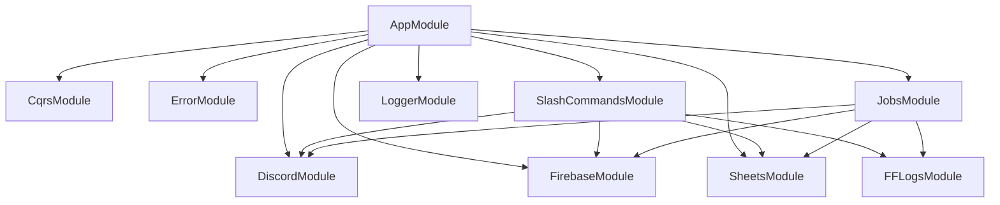
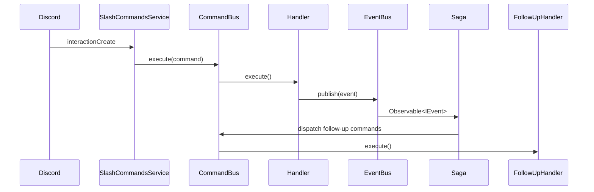

# Architecture Overview

## What the Bot Does

The ulti-project is a Discord bot for managing FFXIV (Final Fantasy XIV) raid group formation. It handles:

1. **Signup intake** — Players submit signup requests via `/signup` with a character, world, job, progression point, and proof link
2. **Coordinator review** — Coordinators approve or decline signups via emoji reactions on a review embed; the bot assigns Discord roles on approval
3. **Sheets sync** — Approved signups are mirrored to Google Sheets for public roster visibility
4. **Automated maintenance** — Daily jobs remove cleared players, clean expired sheet rows, and prune old Discord invites

The bot supports three content modes (`savage`, `ultimate`, `legacy`) which can be run independently or combined. The mode controls which encounter choices and signup options are presented to users.

---

## Why NestJS Application Context (Not HTTP)

The bot is bootstrapped with `NestFactory.createApplicationContext()` rather than the typical `NestFactory.create()` that starts an HTTP server:

```ts
// src/main.ts
const app = await NestFactory.createApplicationContext(AppModule, {
  bufferLogs: true,
});
```

**Reasoning:** This application has no REST endpoints — its entire surface area is Discord interactions and scheduled jobs. Using `createApplicationContext` gives us the full NestJS dependency injection container (modules, providers, lifecycle hooks) without spinning up a network listener. It's the right tool for a pure event-driven application that never needs to handle HTTP requests.

---

## Module Graph

The root `AppModule` composes all feature modules:



Each module is self-contained with its own providers and exports. `FirebaseModule`, `SheetsModule`, and `DiscordModule` are shared infrastructure modules consumed by both the slash-command handlers and the background jobs.

---

## CQRS Pattern

The bot uses NestJS's built-in CQRS module (`@nestjs/cqrs`) throughout. The key motivations:

- **Separation of intent from side effects** — A command (e.g., `SignupCommand`) represents the user's intent. The handler executes that intent and publishes domain events. Side effects (send review message, assign roles, update sheet) are handled by separate event handlers and sagas — not inline in the command handler.
- **Testability** — Command handlers and event handlers are plain classes injected with services. Each can be unit tested in isolation by mocking its dependencies.
- **Async orchestration** — Sagas consume an Observable event stream, making it easy to react to one event by dispatching multiple follow-up commands without coupling the original handler to those concerns.

### Command → Event → Saga Flow



### App-Level Sagas

Cross-cutting workflows are defined in `src/app.sagas.ts`. The four sagas:

| Saga | Trigger | Dispatches |
|------|---------|------------|
| `handleSignupCreated` | `SignupCreatedEvent` | `SendSignupReviewCommand` |
| `handleClearedSignup` | `SignupApprovedEvent` (cleared status) | `RemoveRolesCommand` + `TurboProgRemoveSignupCommand` |
| `handleSignupRemoved` | `RemoveSignupEvent` | `RemoveRolesCommand` + `TurboProgRemoveSignupCommand` |
| `handleSignupApprovalSend` | `SignupApprovalSentEvent` | `BlacklistSearchCommand` |

> **Note:** These sagas live at the `AppModule` level because they orchestrate across module boundaries (signup → roles → sheets). The code includes a TODO acknowledging they could eventually move into a more purpose-built saga module.

---

## Technology Stack

| Concern | Technology | Why |
|---------|-----------|-----|
| Framework | NestJS 11 | DI container, module system, CQRS, lifecycle hooks |
| Discord | Discord.js 14 | De-facto standard Node.js Discord library |
| Database | Firebase Admin / Firestore | Serverless document store; fits guild-scoped config and per-character documents without schema migrations |
| Sheets sync | Google Sheets API v4 | Coordinators want a public-facing spreadsheet roster independent of Discord |
| Clear validation | FF Logs GraphQL API | Authoritative source for FFXIV raid clear data |
| Validation | Zod | Type-safe schema validation at both compile time and runtime for env config and user input |
| Logging | Pino via `nestjs-pino` | Structured JSON logging in production; pretty-printed in development |
| Error monitoring | Sentry (`@sentry/nestjs`) | Captures exceptions with full context (command name, guild, user) and performance traces |
| Linting/Formatting | Biome | Replaces ESLint + Prettier with a single fast tool |
| Testing | Vitest | Fast, ESM-native test runner compatible with the project's `nodenext` module resolution |
| Pattern matching | `ts-pattern` | Exhaustive, type-safe match expressions for command routing |

---

## Error Handling Strategy

Errors are handled at three levels:

1. **Per-command** — Each command handler wraps its logic in try/catch. On failure, `ErrorService.handleCommandError()` sends a user-friendly Discord embed to the interaction and logs/captures to Sentry.

2. **Unhandled exceptions** — `AppService` subscribes to the CQRS `UnhandledExceptionBus`. Any exception that escapes a handler is caught here and forwarded to `ErrorService.captureError()` (which logs and sends to Sentry without a Discord reply, since there may be no active interaction).

3. **Discord client errors** — The `DiscordModule` hooks into `client.once('error', ...)` to capture low-level Discord.js errors via Sentry.

All Sentry captures include structured context: command name, guild ID, user ID, and the relevant entity (e.g., the signup document). The `@SentryTraced()` decorator is applied to service methods to create performance spans automatically.

---

## Logging

Structured logging uses Pino:
- **Development:** `pino-pretty` with `singleLine: true` for readable terminal output
- **Production:** Raw JSON (no transport), consumed by log aggregation infrastructure
- **Level:** Controlled by the `LOG_LEVEL` environment variable (default: `info`)

The logger is bootstrapped with `bufferLogs: true` so early startup messages are not lost before the logger is fully initialized.
