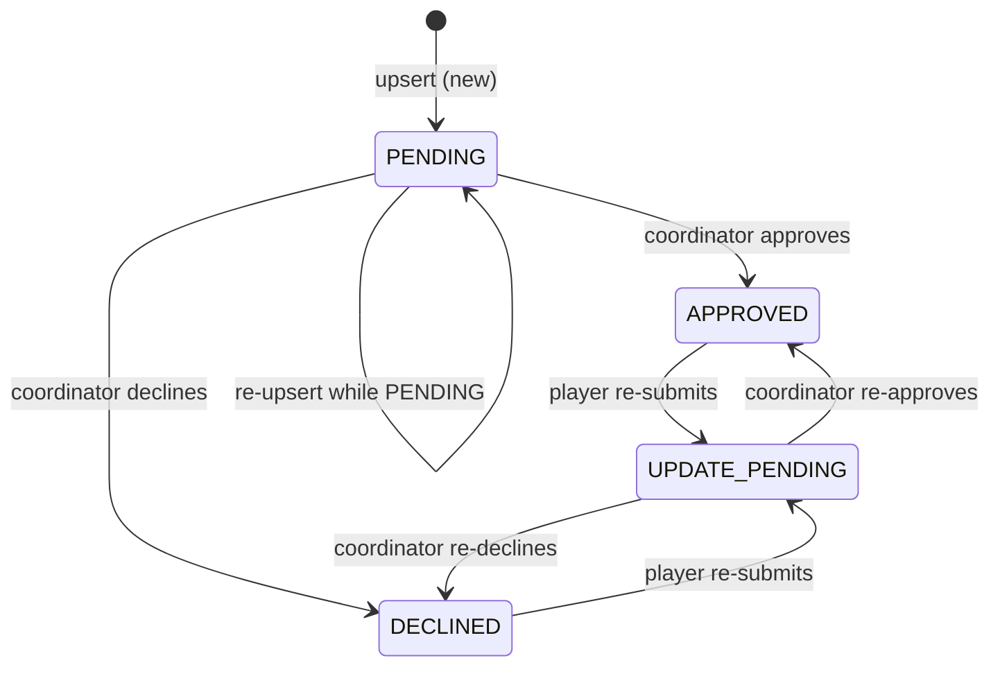

# Data Layer

## Why Firestore

The application uses Firebase Admin SDK / Firestore as its primary data store. Key reasons for this choice:

- **Serverless, no infrastructure to manage** — No database server to provision, patch, or scale. Firestore scales automatically and fits a Discord bot's bursty, low-volume access pattern.
- **Document model fits the domain** — Each Discord guild is isolated; settings and signups are naturally scoped per-guild. The document model avoids the relational join complexity that would arise from a SQL schema.
- **Per-character signups** — Each signup is one document; there's no need for complex relational queries. Firestore's `where()` chaining is sufficient.
- **Firebase Admin + GCP** — The bot already uses GCP service accounts for Google Sheets, so sharing GCP credentials with Firestore avoids introducing a second auth provider.

---

## Collections

The `FirebaseModule` (`src/firebase/firebase.module.ts`) initializes Firestore and exports five collection services:

| Collection | Service Class | Purpose |
|------------|--------------|---------|
| `signups` | `SignupCollection` | One document per player per encounter |
| `settings` | `SettingsCollection` | Guild-level bot configuration |
| `blacklist` | `BlacklistCollection` | Players blocked from signing up |
| `jobs` | `JobCollection` | Per-guild cron job enable/disable flags |
| `encounters` | `EncountersCollection` | Encounter definitions with prog points and party thresholds |

---

## SignupDocument

**Path:** `src/firebase/models/signup.model.ts`

```ts
interface SignupDocument {
  character: string;
  discordId: string;
  encounter: Encounter;
  username: string;
  world: string;
  role: string;               // freeform job/class field
  progPointRequested: string; // submitted by the player
  progPoint?: string;         // assigned by the coordinator on review
  partyStatus?: PartyStatus;  // EarlyProgParty | ProgParty | ClearParty | Cleared
  status: SignupStatus;
  reviewedBy?: string | null; // discordId of coordinator
  reviewMessageId?: string;   // Discord message ID of the review embed
  proofOfProgLink?: string | null;
  screenshot?: string | null; // Discord CDN URL (expires after ~2 weeks)
  notes?: string | null;
  declineReason?: string;
  expiresAt: Timestamp;       // 28 days from last upsert
}
```

### Status State Machine



**Why `UPDATE_PENDING`?** When a player re-submits a signup that was previously reviewed, simply reverting to `PENDING` would mix re-submissions with fresh signups in a coordinator's queue and lose the context that this is a revision. `UPDATE_PENDING` signals coordinators that this needs fresh attention.

### Composite Key Design

**Path:** `src/firebase/collections/signup.collection.ts`

```ts
static getKeyForSignup({ discordId, encounter }: SignupCompositeKey) {
  return `${discordId.toLowerCase()}-${encounter}`;
}
```

The document ID is `{discordId}-{encounter}` (e.g., `123456789-TOP`). This enforces **one signup per player per encounter** at the database level — upserts always hit the same document, making idempotency free. It also makes direct document lookups O(1) without needing a query.

`discordId` is lowercased to guard against any case inconsistency at the call sites.

### TTL (Expiry)

Each signup has an `expiresAt` Timestamp set to 28 days from the last upsert. Firestore's TTL feature can be configured to automatically delete expired documents. This prevents stale signups from accumulating indefinitely without requiring explicit cleanup logic in the application.

---

## SettingsDocument

**Path:** `src/firebase/models/settings.model.ts`

Stores all guild-level bot configuration in a single document (document ID = guild ID):

- **Channel IDs** — `reviewChannel`, `signupChannel`, `autoModChannelId`
- **Role IDs** — `reviewerRole` (gate for who can approve signups)
- **Per-encounter role maps** — `progRoles: Record<Encounter, string>`, `clearRoles: Record<Encounter, string>` — Discord role IDs to assign upon approval
- **Spreadsheet IDs** — `spreadsheetId` (signup roster), `turboProgSpreadsheetId`

### In-Memory Cache

`SettingsCollection` maintains a `Map<string, SettingsDocument>` cache keyed by `settings:{guildId}`:

```ts
private readonly cache = new Map<string, unknown>();
private cacheKey = (guildId: string) => `settings:${guildId}`;
```

**Why cache?** Settings are read on virtually every command execution (to find the review channel, check reviewer role, get spreadsheet ID). Without caching, each interaction would incur a Firestore read. Settings rarely change — coordinators update them infrequently — so a write-through cache (invalidated on `upsert()`) is a good trade-off.

**Cache invalidation:** After any `upsert()`, the cache is synchronously refreshed from Firestore. On a cache-update failure, the key is deleted (forcing the next read to hit Firestore) rather than serving stale data.

---

## BlacklistDocument

**Path:** `src/firebase/models/blacklist.model.ts`

Simple document per blacklisted player:

```ts
interface BlacklistDocument {
  characterName: string;
  discordId: string;
  reason?: string;
  lodestoneId?: string;
}
```

Used to surface blacklist status in `/lookup` and to run a background check after every signup approval (`BlacklistSearchCommand` dispatched by `handleSignupApprovalSend` saga).

---

## EncountersCollection

Stores encounter definitions dynamically in Firestore rather than hardcoding them. Each document represents one encounter (e.g., TOP, DSR) with:

- `name`, `description`, `active`
- `progPartyThreshold`, `clearPartyThreshold` — min signups to form a prog vs. clear party
- `ProgPointDocuments` — the list of valid prog points for that encounter

This allows coordinators to manage encounters and their prog points via the `/encounters` slash command without requiring a code deployment.

---

## JobCollection

Stores per-guild feature flags for background jobs. Each job (clear-checker, sheet-cleaner, invite-cleaner) reads this collection at runtime to determine whether it is enabled for a given guild. This lets operators enable/disable maintenance jobs per server without configuration redeployment.

---

## Firestore Initialization

```ts
// src/firebase/firebase.module.ts
initializeApp({
  credential: cert({
    clientEmail: appConfig.GCP_ACCOUNT_EMAIL,
    privateKey: appConfig.GCP_PRIVATE_KEY,
    projectId: appConfig.GCP_PROJECT_ID,
  }),
});

const firestore = firebaseConfig.FIRESTORE_DATABASE_ID
  ? getFirestore(app, firebaseConfig.FIRESTORE_DATABASE_ID)
  : getFirestore(app);

firestore.settings({ ignoreUndefinedProperties: true });
```

`ignoreUndefinedProperties: true` prevents Firestore from throwing when a document field is `undefined` (TypeScript optional fields). Without this, every optional field would need explicit `null` coercion before writing.

The optional `FIRESTORE_DATABASE_ID` supports running multiple named Firestore databases in the same GCP project (e.g., a staging database separate from production).
