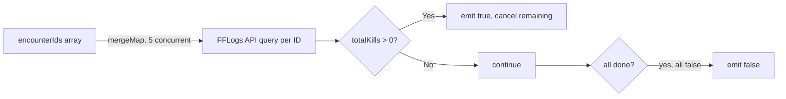

# Integrations

## Discord.js

**Module:** `src/discord/discord.module.ts`
**Service:** `src/discord/discord.service.ts`

### Client Setup

The Discord.js `Client` is created in `DiscordModule` with carefully chosen intents and partials. Only the intents the bot actually needs are enabled — Discord.js will throw if you request data from an intent not declared at connection time, and unnecessary intents increase the event volume the process receives.

### Memory Management

Discord.js caches guild data in-process by default. For a bot that may be in many guilds, uncontrolled caching can become a memory problem. The module disables or limits several caches:

```ts
// Caches entirely disabled (bot doesn't use these)
makeCache: Options.cacheWithLimits({
  PresenceManager: 0,          // Presence updates not used
  DMMessageManager: 0,         // DMs not used
  GuildTextThreadManager: 0,   // Threads not used
})
```

**Sweepers** run on intervals to evict stale entries from caches that are kept:

| Cache | Interval | Condition |
|-------|----------|-----------|
| Guild members | 2 hours | Not bot itself |
| Messages | 12-hour lifetime | All messages |
| Reactions | 2 hours | All reactions |
| Users | 2 hours | Not bot itself |

**Why sweepers?** Discord.js's default behavior retains every member/message seen for the lifetime of the process. For a long-running bot, this is an unbounded memory leak. Sweeping periodically bounds the memory footprint.

### Graceful Shutdown

On `onApplicationShutdown`, the module calls `client.removeAllListeners()`. This ensures event listeners don't fire against a destroyed client during NestJS's shutdown sequence, avoiding unhandled-rejection noise in logs.

### DiscordService Utilities

`DiscordService` provides commonly needed Discord operations used across multiple command handlers:

| Method | Purpose |
|--------|---------|
| `getGuildMember()` | Fetch a guild member with error handling |
| `sendDirectMessage()` | DM a user |
| `getTextChannel()` | Fetch a text-based channel |
| `getDisplayName()` | Get member's display name |
| `userHasRole()` | Check if a member has a role |
| `removeRole()` | Bulk-remove a role from members (50 concurrent) |
| `retireRole()` | Swap one role for another across members (5 concurrent) |
| `getGuildInvites()` | Fetch all guild invites |

Concurrency limits on bulk operations (`p-limit` / `mergeMap` with max concurrent) prevent hitting Discord's rate limits when operating on large guilds.

---

## Google Sheets

**Module:** `src/sheets/sheets.module.ts`
**Service:** `src/sheets/sheets.service.ts`

### Purpose

Google Sheets serves as a **public-facing view** of signup rosters. Firestore is the authoritative source of truth; Sheets is a presentation layer that coordinators and players can view without Discord access. Coordinators also use the sheets to manage party composition visually.

### Why Sheets in Addition to Firestore?

The signup workflow predates this bot — coordinators were already using Sheets to manage raids. The bot integrates with that existing workflow rather than replacing it. Sheets also provides a familiar tabular interface for managing large numbers of signups across multiple encounters.

### Authentication

The Sheets client authenticates using a GCP service account (same credentials as Firestore):

```ts
const auth = new google.auth.GoogleAuth({
  credentials: {
    client_email: appConfig.GCP_ACCOUNT_EMAIL,
    private_key: appConfig.GCP_PRIVATE_KEY,
  },
  scopes: ['https://www.googleapis.com/auth/spreadsheets'],
});
```

### Party Type Routing

Signups are written to different sheet tabs based on their `partyStatus`:

| `PartyStatus` | Sheet Tab |
|--------------|-----------|
| `EarlyProgParty` | Early Prog Party |
| `ProgParty` | Prog Party |
| `ClearParty` | Clear Party |
| `Cleared` | Removed from sheets |

When a signup transitions to `Cleared`, the character is deleted from whatever sheet they were on.

### AsyncQueue for Serialized Writes

`SheetsService` uses a custom `AsyncQueue` (`src/common/async-queue/async-queue.ts`) backed by RxJS `concatMap` to serialize writes to each party-type sheet:

```ts
private readonly partyQueues = new Map<PartyStatus, AsyncQueue>();
```

**Why serialize?** Google Sheets API does not support concurrent writes to the same spreadsheet safely. If two signups arrive simultaneously and both try to append a row, the second write can corrupt the sheet state (overwrite the first row, produce gaps, or fail entirely). The queue ensures writes are processed one at a time per party type, with a separate queue for TurboProg sheets.

---

## FF Logs GraphQL API

**Module:** `src/fflogs/fflogs.module.ts`
**Service:** `src/fflogs/fflogs.service.ts`

### Purpose

FF Logs is the authoritative FFXIV raid logging platform. The integration serves two functions:

1. **Proof validation on signup** — When a player submits an FF Logs report URL as their prog proof, the bot verifies the report is recent (not older than the configured max age). This prevents players from submitting stale or irrelevant logs.
2. **Clear checking** — A nightly job queries FF Logs to detect whether signed-up players have cleared the encounter since their signup, automatically removing them from the queue.

### Authentication

FF Logs uses a client credentials OAuth2 flow. The bot authenticates with a Bearer token (`FFLOGS_API_ACCESS_TOKEN` env var). If this token is not configured, FF Logs features degrade gracefully (validation is skipped, clear checking is not run).

### GraphQL SDK

The GraphQL client is generated from the FF Logs schema (`schema.graphql`) via `pnpm graphql:codegen`. This produces a typed SDK, so all queries and their responses are fully type-safe. The underlying HTTP transport is `graphql-request`.

### Encounter ID Mapping

FF Logs identifies fights by numeric encounter IDs, and FFXIV patches sometimes change these IDs as content is updated. The `FFLOGS_ENCOUNTER_IDS` map (`src/fflogs/fflogs.consts.ts`) maps each encounter name to an array of known IDs:

```ts
// Example: TOP has two known encounter IDs (different patch versions)
TOP: [1068, 1077]
```

When checking for a clear, the service queries all known IDs for the encounter concurrently (up to 5 at a time via `mergeMap`) and returns `true` on the first successful result.

### Observable-Based Clear Check



**Why RxJS Observables?** The concurrent query pattern (fan-out, take-first-truthy) maps naturally to `mergeMap` + `first()`. With Promises this would require `Promise.any()` with manual cancellation; RxJS handles both automatically via `takeWhile` or `first` operators.

### Report Age Validation

`validateReportAge()` queries the FF Logs API for a report's `endTime` (the timestamp of the last recorded pull, not the first) and compares it against the configured `FFLOGS_REPORT_MAX_AGE_DAYS`:

```ts
// endTime is used, not startTime
// A report from 3 months ago that was recently re-parsed still fails validation
```

Using `endTime` means a report is considered current based on when the actual play session ended, not when the log was created.

The method returns a structured result:

```ts
{ isValid: boolean; errorMessage?: string; reportDate?: Date }
```

If the FF Logs API is unreachable, the handler catches the error, logs it, and allows the signup to proceed (fail open). This is a deliberate trade-off: a transient API outage should not block legitimate signups.

---

## Authentication Summary

| Service | Auth Method | Credentials |
|---------|------------|-------------|
| Discord | Bot token | `DISCORD_TOKEN` env var |
| Firestore | GCP service account | `GCP_ACCOUNT_EMAIL` + `GCP_PRIVATE_KEY` + `GCP_PROJECT_ID` |
| Google Sheets | GCP service account (same) | Same GCP credentials |
| FF Logs | Bearer token | `FFLOGS_API_ACCESS_TOKEN` env var |

All credentials are loaded at startup via Zod-validated environment variables. If required credentials are missing, the process fails fast with a descriptive error before connecting to Discord.
