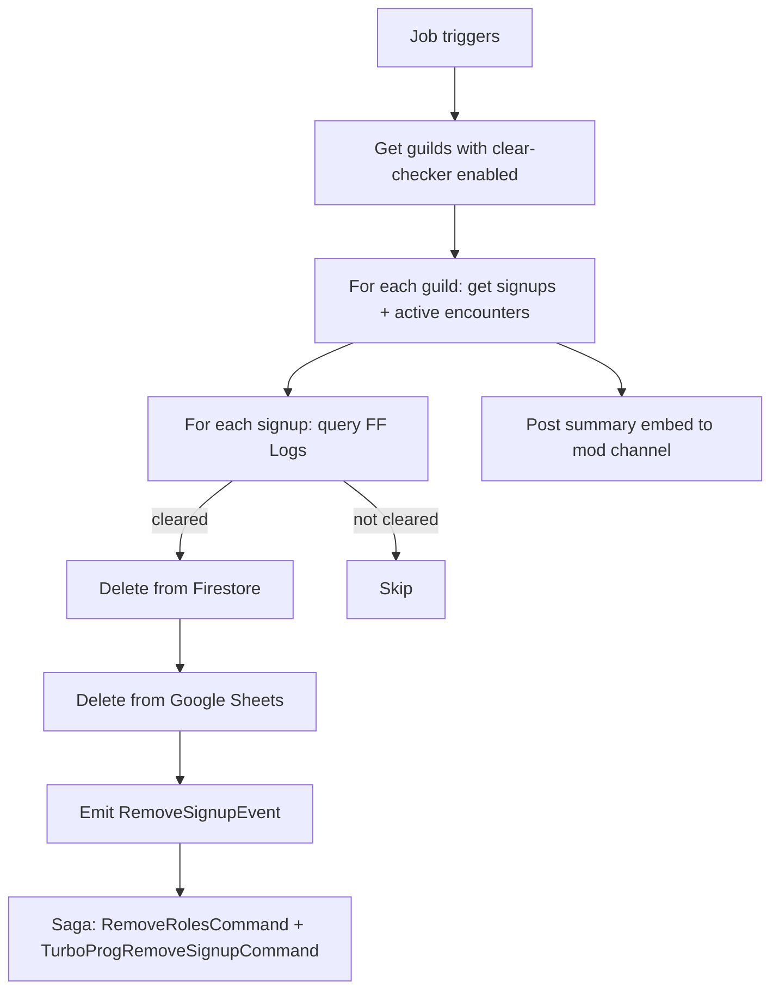
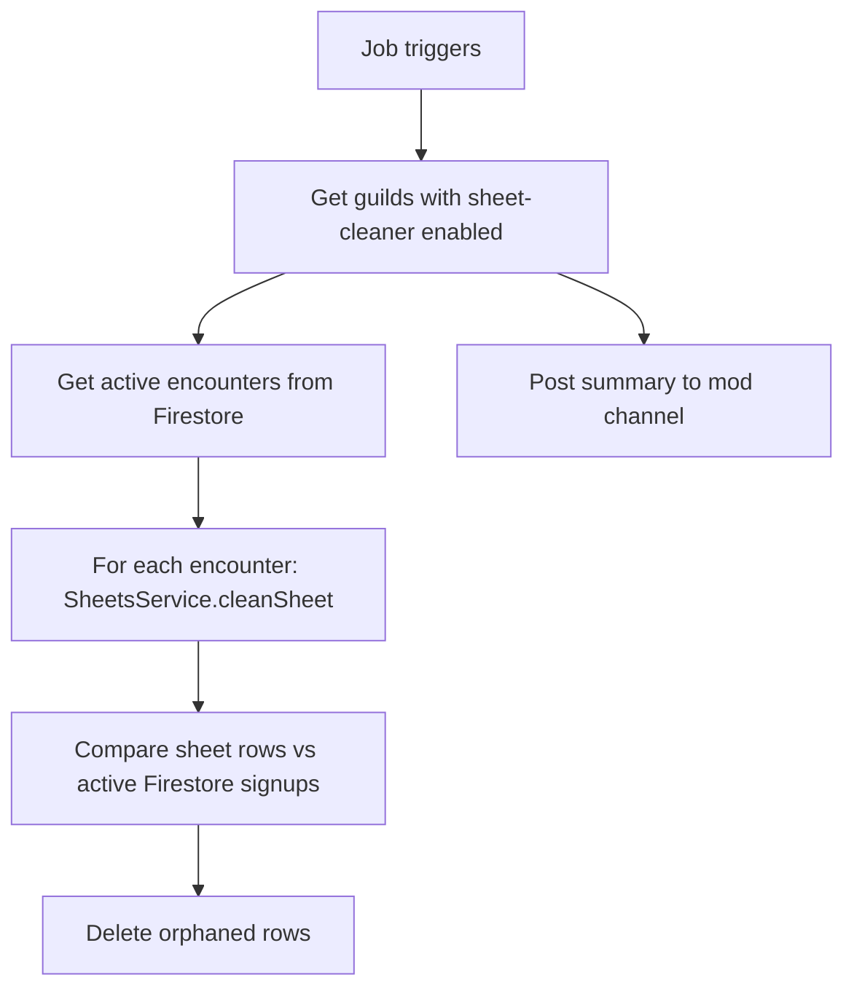
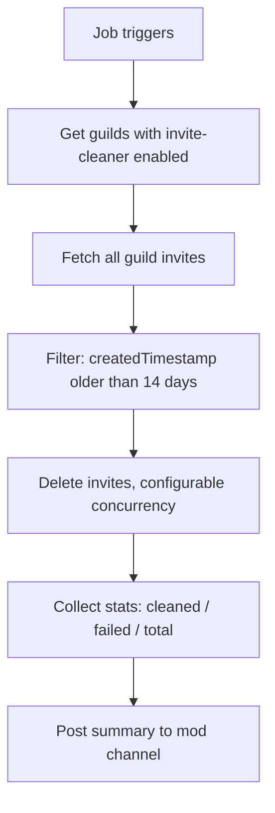

# Scheduled Jobs

## Overview

The `JobsModule` (`src/jobs/jobs.module.ts`) hosts three background cron jobs that run daily to maintain the integrity of the signup system. Each job:

- Implements `OnApplicationBootstrap` and `OnApplicationShutdown` for clean lifecycle management
- Reads per-guild enable/disable flags from `JobCollection` in Firestore — so each guild can opt in/out without affecting others
- Uses RxJS streams internally for concurrent processing
- Posts a summary embed to each guild's `autoModChannelId` after running

```mermaid
gantt
    title Daily Job Schedule (approximate)
    dateFormat HH:mm
    section Jobs
    Clear Checker   :03:00, 1h
    Sheet Cleaner   :04:00, 1h
    Invite Cleaner  :05:00, 30m
```



---

## CronTime DSL

Jobs use a fluent DSL (`src/common/cron.ts`) rather than raw cron strings:

```ts
CronTime.everyDay().at(3)        // '0 0 3 * * *'
CronTime.everyDay().at(4, 30)    // '0 30 4 * * *'
CronTime.everyHour().at(30)      // '0 30 * * * *'
CronTime.everyWeek().on(0).at(12) // '0 0 12 * * 0'
```

**Why a DSL?** Raw cron expressions are error-prone to read and write (the difference between `0 3 * * *` and `0 0 3 * * *` is significant and hard to spot). The DSL is self-documenting and prevents common field-ordering mistakes.

---

## Clear Checker Job

**Path:** `src/jobs/clear-checker/clear-checker.job.ts`
**Schedule:** Daily at 3 AM

### Purpose

Automatically removes signups from players who have cleared the encounter since they signed up, freeing their slot for other players without requiring manual coordinator action.

### Flow



FF Logs queries run with up to 5 concurrent requests per guild (via `mergeMap` concurrency control) to respect API rate limits while still processing quickly.

The `RemoveSignupEvent` is published through the CQRS event bus, which triggers the saga to dispatch role removal and TurboProg sheet cleanup. This reuses the exact same side-effect logic as the `/remove-signup` command — no duplication.

### Graceful Degradation

If the FF Logs API is unavailable, the job logs the error and skips clear-checking for that run. Signups are not removed if their clear status cannot be confirmed.

---

## Sheet Cleaner Job

**Path:** `src/jobs/sheet-cleaner/sheet-cleaner.job.ts`
**Schedule:** Daily at 4 AM

### Purpose

Removes rows from Google Sheets for signups that no longer exist in Firestore (e.g., expired via TTL, manually removed, or cleaned up by the clear checker). Prevents the sheets from accumulating orphaned rows.

### Flow



**Sequential processing with `concatMap`:** Each encounter's sheet is cleaned one at a time (sequentially) rather than in parallel. This prevents concurrent writes from corrupting the spreadsheet — the same reason `SheetsService` uses an `AsyncQueue` for normal signup writes.

### Dynamic Encounters

The job fetches the list of active encounters from `EncountersCollection` at runtime rather than using a hardcoded list. As coordinators add or retire encounters via `/encounters`, the sheet cleaner automatically adapts.

---

## Invite Cleaner Job

**Path:** `src/jobs/invite-cleaner/invite-cleaner.job.ts`
**Schedule:** Daily at 5 AM

### Purpose

Deletes Discord guild invites older than 14 days. Prevents invite link accumulation when coordinators create temporary invites to onboard new members.

### Flow



Invite deletion runs with configurable concurrency (`INVITE_CLEANER_CONCURRENCY` env var) to avoid Discord rate limits.

---

## Per-Guild Enable/Disable

Each job checks `JobCollection` in Firestore before doing any work for a guild. A missing or `false` flag means the job is skipped for that guild. This allows:

- **Phased rollout** — Enable jobs for specific guilds before a full rollout
- **Opt-out** — Guilds that manage their own cleanup can disable individual jobs
- **Emergency stop** — A job behaving unexpectedly can be disabled without a deployment

---

## Summary Embeds

After each job run, a summary embed is posted to the guild's `autoModChannelId`. The embed includes:
- Total entities processed
- Count of successful operations
- Count of failures (with reasons where available)

This provides an audit trail of automated actions without requiring coordinators to inspect logs directly.
