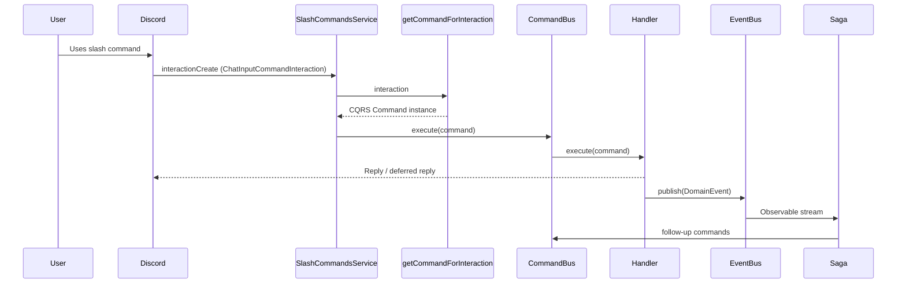
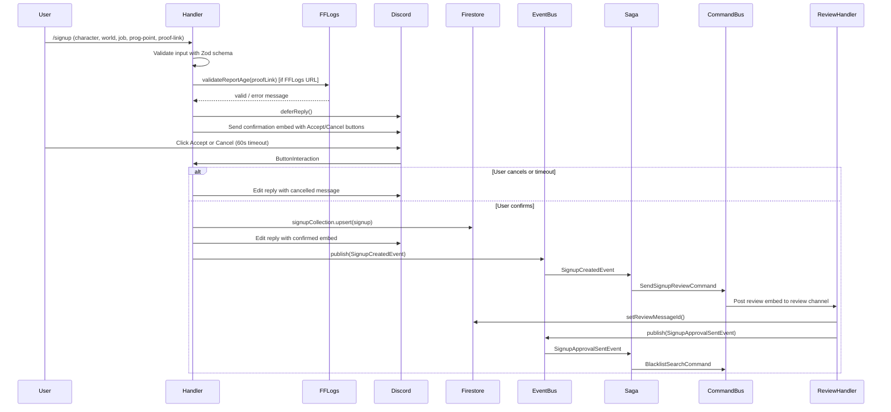

# Slash Commands

## Overview

All Discord slash commands live under `src/slash-commands/`. Each command is a self-contained NestJS module following a consistent file convention. The `SlashCommandsModule` imports all individual command modules and registers one interaction listener that dispatches incoming Discord interactions to the appropriate CQRS command handler.

---

## File Conventions

Every command feature follows this three-file pattern:

| File | Role |
|------|------|
| `<name>.slash-command.ts` | Discord.js `SlashCommandBuilder` definition — the shape of the command Discord presents to users (name, description, options, permissions) |
| `commands/<name>.command.ts` | CQRS command class — a plain data-transfer object carrying the `ChatInputCommandInteraction` and any pre-extracted context |
| `handlers/<name>.command-handler.ts` | CQRS command handler — the business logic (`@CommandHandler(...)` + `execute()`) |

**Why this split?** The slash-command definition file is deliberately kept free of logic — it's a pure Discord API contract. The command class is a lightweight DTO. All meaningful work happens in the handler, which can be unit tested without any Discord or NestJS setup overhead.

Additional files per feature as needed:
- `<name>.schema.ts` — Zod schema for validating user-supplied input
- `<name>.module.ts` — NestJS module wiring the handler and any local services
- `events/<name>.events.ts` — CQRS event class definitions
- `handlers/<name>.event-handler.ts` — CQRS event handler for side effects

---

## Command List

| Command | Admin Only | Description |
|---------|-----------|-------------|
| `/signup` | No | Submit a raid signup with character, world, job, prog point, and proof |
| `/remove-signup` | No | Remove an existing signup for an encounter |
| `/status` | No | View your own signup statuses across all encounters |
| `/help` | No | Display all available commands |
| `/search` | Yes | Search signups by encounter and prog point (interactive menus) |
| `/lookup` | Yes | Look up all signups for a player by character name + world, including blacklist status |
| `/blacklist add/remove/display` | Yes | Manage the list of players blocked from signing up |
| `/encounters` | Yes | Configure encounter prog points and party size thresholds |
| `/settings channels/reviewer/encounter-roles/spreadsheet/turbo-prog/view` | Yes (Manage Guild) | Configure bot channels, roles, reviewer gate, and spreadsheet IDs |
| `/turbo-prog` | No | Submit a lightweight signup for a turbo-prog or final-push event |
| `/final-push` | No | Alias for `/turbo-prog` — same handler, different command name |
| `/clean-roles` | Yes | Remove prog/clear roles from members without active signups (supports dry-run) |
| `/remove-role` | Yes | Bulk remove a specific role from all guild members |
| `/retire` | Yes | Move members from one role to another (for retiring a raid tier) |

---

## Command Lifecycle



---

## Command Routing

`src/slash-commands/slash-commands.utils.ts` contains `getCommandForInteraction()`, which maps a Discord interaction's `commandName` (and optionally `subcommand`) to a CQRS command instance using the `ts-pattern` `match()` function:

```ts
return match(interaction.commandName)
  .with(BlacklistSlashCommand.name, () => {
    const subcommand = interaction.options.getSubcommand();
    return match(subcommand)
      .with('add', () => new BlacklistAddCommand(interaction))
      .with('remove', () => new BlacklistRemoveCommand(interaction))
      .with('display', () => new BlacklistDisplayCommand(interaction))
      .run();
  })
  .with(SIGNUP_SLASH_COMMAND_NAME, () => new SignupCommand(interaction))
  // ...
  .otherwise(() => undefined);
```

**Why `ts-pattern`?** It provides exhaustive, type-safe pattern matching. An unrecognized command returns `undefined` rather than throwing — the service gracefully ignores unknown interactions (e.g., stale commands from a previous version).

**Subcommand dispatch:** For commands with subcommands (`/blacklist`, `/settings`, `/encounters`), the top-level `commandName` match resolves to a nested `match` on the subcommand string. Each subcommand gets its own CQRS command class and dedicated handler — avoiding large branching in a single handler.

---

## CQRS Rationale

Using NestJS CQRS (commands + events + sagas) rather than direct service-to-service calls provides:

- **Decoupling** — The signup handler doesn't know about the review channel, Sheets service, or role management. It publishes a `SignupCreatedEvent` and those concerns react independently.
- **Side-effect isolation** — Side effects (DM to user, sheet update, role assignment) live in event handlers. If one fails, the others are not blocked.
- **Testability** — Each handler is a class with explicit dependencies. Unit tests can stub the event bus entirely and test handler logic in isolation.
- **Async orchestration via sagas** — Sagas convert event streams into command streams using RxJS operators. A cleared-signup approval can fan out to both a role-removal command and a TurboProg sheet cleanup command without those concerns touching each other.

---

## Signup Flow (Deep Dive)

The `/signup` command is the most complex in the system. Its handler (`src/slash-commands/signup/handlers/signup.command-handler.ts`) orchestrates:



**FF Logs validation** is performed before confirmation. If the supplied link is an FF Logs report URL, the handler queries the FF Logs API to verify the report is not older than the configured maximum age. If validation fails, the user is told why and the signup is rejected early. If the FF Logs API is unavailable, validation is skipped gracefully (the feature degrades, not fails).

**Proof link URL validation** also enforces an allowlist of accepted domains (fflogs.com, streamable, twitch, youtube, medal.tv) to prevent spoofing via lookalike URLs.

**Upsert behavior** — If the player already has a signup for that encounter:
- If still `PENDING`: fields are updated in place, status stays `PENDING`
- If previously reviewed (`APPROVED`/`DECLINED`): status transitions to `UPDATE_PENDING`, signalling coordinators need to re-review

---

## Subcommand Pattern

Commands with multiple related subcommands (e.g., `/settings`, `/encounters`, `/blacklist`) use a single top-level slash command definition with `addSubcommand()` entries, and a single parent CQRS command class that wraps the interaction. The parent handler's `execute()` reads `interaction.options.getSubcommand()` and dispatches to a child command via `this.commandBus.execute(childCommand)`.

This keeps the Discord command tree tidy while letting each subcommand have its own focused handler class.
